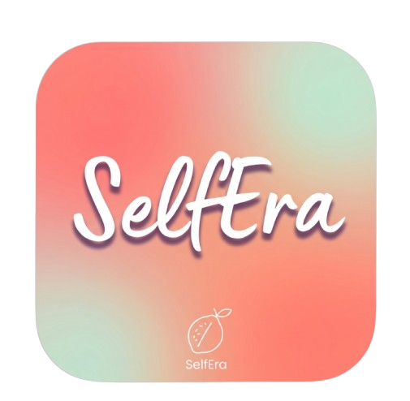
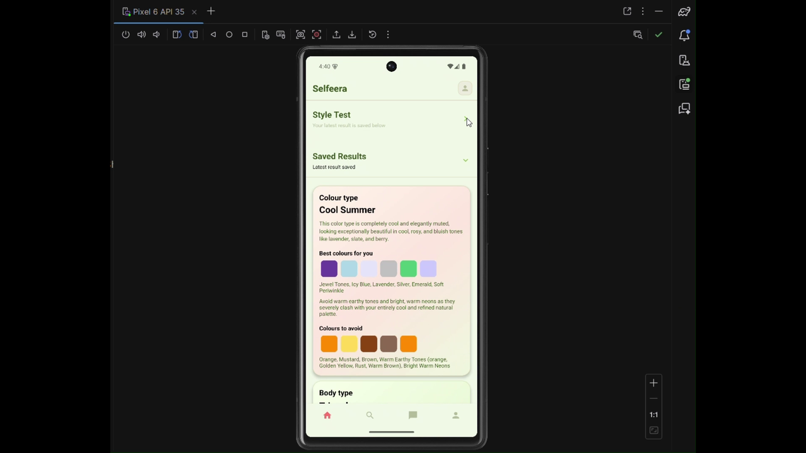

<table>
  <tr>
    <td width="260" valign="top">
      
    </td>
    <td valign="top">
      <h1>SelfEra</h1>
      
<em>App for color analysis exploration and booking beauty services. An instrument for beauty masters to handle their business.</em>

    </td>
  </tr>
</table>

---

## Architecture

SelfEra follows a **client–server** model. The Android client is built with **Kotlin**, **Jetpack Compose**, and **Retrofit** for a responsive mobile experience. The REST API is powered by **Django** and **PostgreSQL**, with **Cloudinary** handling profile photos and outfit assets.

The backend lives in a separate repository: **[beautyAppBackend](https://github.com/sana23ok/beautyAppBackend)**. The production API is hosted at `https://beautyappbackend.onrender.com/`.

---

## Installation

📥 [**Download SelfEra APK**](media/SelfEra.apk) · Android 7.0+ (API 24)

---

## Deployment

**REST API** and **PostgreSQL** on [Render](https://render.com), **media** on Cloudinary. Backend deploys with automatic migrations; the app reads the API URL from `local.properties` at build time.

---

## Features

- **Color & appearance analysis** — personalized recommendations by seasonal color type, body shape, and style goals
- **Master search & booking** — browse beauty professionals, view services, and schedule appointments
- **Master workspace** — manage price lists, availability, bookings, and client communication
- **In-app chat** — real-time messaging between clients and masters
- **Outfit inspiration** — curated looks matched to your color palette via Cloudinary
- **Google Sign-In** — quick and secure authentication
- **Moderation tools** — admin review flow for master profiles

---

## Video demonstration of an app

Watch a walkthrough of the sign-in flow, navigation, and core features:

  

  ▶️ <a href="https://youtu.be/fy1KcxZ2toU"><strong>Watch on YouTube</strong></a>

---

**SelfEra** — discover your colors, connect with masters, book with confidence.

Built with Kotlin · Django · PostgreSQL · Cloudinary

